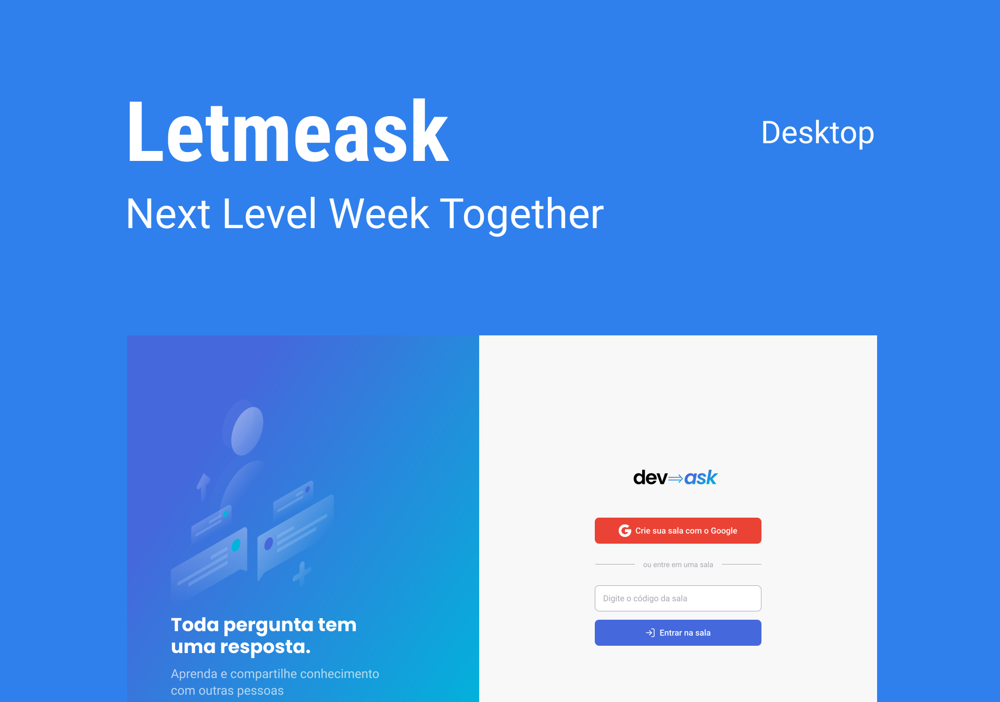

<p align="center">
  
</p>

<p align="center">  
  

     
</p>

<h1 align="center">
    
</h1>

<br>

## 🧪 Tecnologias

Esse projeto foi desenvolvido com as seguintes tecnologias:

- [React](https://reactjs.org)
- [Firebase](https://firebase.google.com/)
- [TypeScript](https://www.typescriptlang.org/)

## 🚀 Como executar

Clone o projeto e acesse a pasta do mesmo.

```bash
$ git clone https://github.com/yurischulz/devask
$ cd devask
```

Para iniciá-lo, siga os passos abaixo:

```bash
# Instalar as dependências
$ yarn

# Iniciar o projeto
$ yarn start
```

O app estará disponível no seu browser pelo endereço http://localhost:3000.

Lembrando que será necessário criar uma conta no [Firebase](https://firebase.google.com/) e um projeto para disponibilizar um Realtime Database.

## 💻 Projeto

Este é um projeto desenvolvido durante a **[Next Level Week Together](https://nextlevelweek.com/)**, apresentada dos dias 20 a 27 de Junho de 2021.

Devask é perfeito para educadores no nicho de desenvolvimento poderem criar salas de Q&A com o seu público, de uma forma muito organizada e democrática.

Além disto, a identidade visual do projeto foi adaptada, e, também, foi implementado uma série de melhorias e novas funcionalidades, tais como:

- Funcionalidade de resposta pelo admin da sala
- Alterado as tags `<textarea />` para o componente `<MarkdownEditor />` do pacote \*\*[@uiw/react-markdown-editor](https://github.com/uiwjs/react-markdown-editor), possibilitando que os usuários insiram códigos com highlight em suas perguntas e respostas

## 🔖 Layout

Você pode visualizar o layout do projeto através do link abaixo:

- [Layout Web](https://www.figma.com/file/uD4KMEsZtdDeRTVBcjMM2Z/Devask)

Lembrando que você precisa ter uma conta no [Figma](http://figma.com/).

## 📝 License

Esse projeto está sob a licença MIT. Veja o arquivo [LICENSE](LICENSE.md) para mais detalhes.
